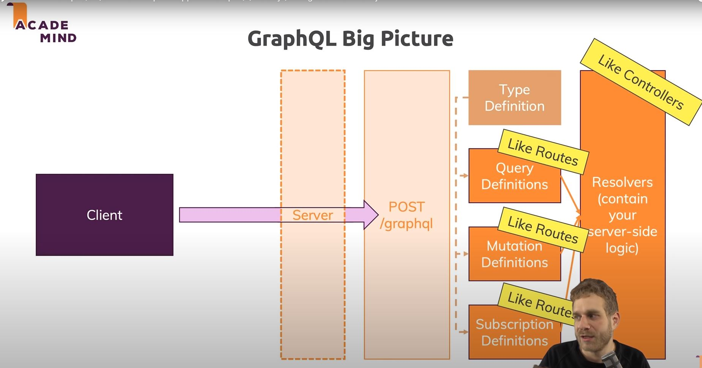

## REST API Limitaions

> GET `/post` 라는 API Endpoint 가 있고, 아래와 같은 값을 리턴해준다.

```js
{
    id: '1',
    title: 'First Post',
    content: '...',
    author: {...},
}
```

만약, 우리에게 `title`과 `id`만 필요하다면 어떻게 할 수 있을까?

1. 새로운 REST API Endpoint 를 만든다
2. Query Parameter를 이용한다.

첫 번째 방법의 문제는 Endpoint가 많아 질수록 관리가 힘들어 진다.
두 번째 방법의 문제는 API를 이해하기 힘들어 진다.

여기서 우리는

`GrapQL`을 사용한다.

## How does GraphQL Work?

하나의 Endpoint만 존재하며, 쿼리를 포함하고 있는 POST 요청을 보낸다. 여기서 Query는 전달 받을 데이터가 어떻게 생겼는지를 정의한다.

```js
{
    query {
        user {
            name
            age
        }
    }
}
```

- query: Operation Type (Other types: mutation, subscription)

- user: Operation "endpoint"

- name, age: Requested fields

Query --> Retrieve Data ("GET")

Mutation --> Manipulate Data ("POST", "PUT", "PATCH", "DELETE")

Subscription --> Set up realtime connection via Websockets


